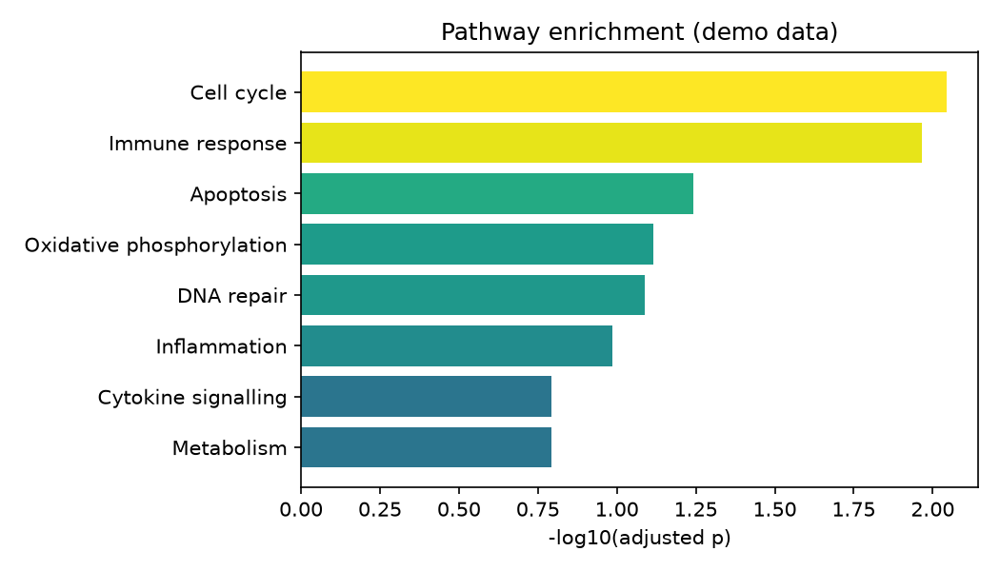

# Gene Set Enrichment Barplot

A hundred significant genes is not a result — it is homework. Pathway enrichment turns that gene list into a sentence: 'cell cycle and immune signalling are driving this.'

## Why This Matters

Single genes are hard to interpret; pathways are the language biologists actually think in. Enrichment asks which predefined gene sets are over-represented among your hits, and a ranked bar plot makes the answer obvious at a glance — so your results section writes itself.

## How It Works

1. Score each gene set for over-representation in your hits.
2. Convert the p-values to -log10.
3. Sort the sets and draw a horizontal bar plot.

## What the Demo Shows



The demo simulates enrichment across eight pathways. The longest bars — the most significant sets — sit at the top, which are the pathways you would lead your discussion with.

## Run It

```bash
pip install -r requirements.txt
python demo.py
```

> Demonstrated on synthetic data, so the whole thing is reproducible with no external downloads.
